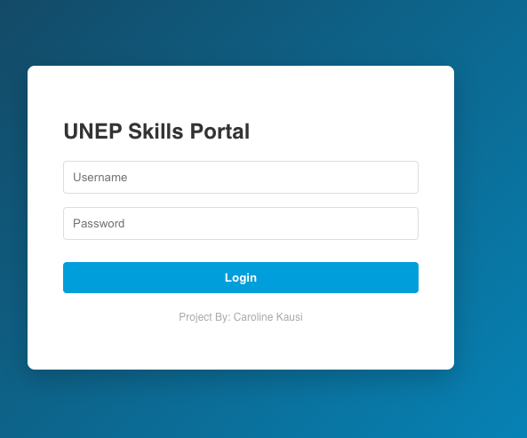
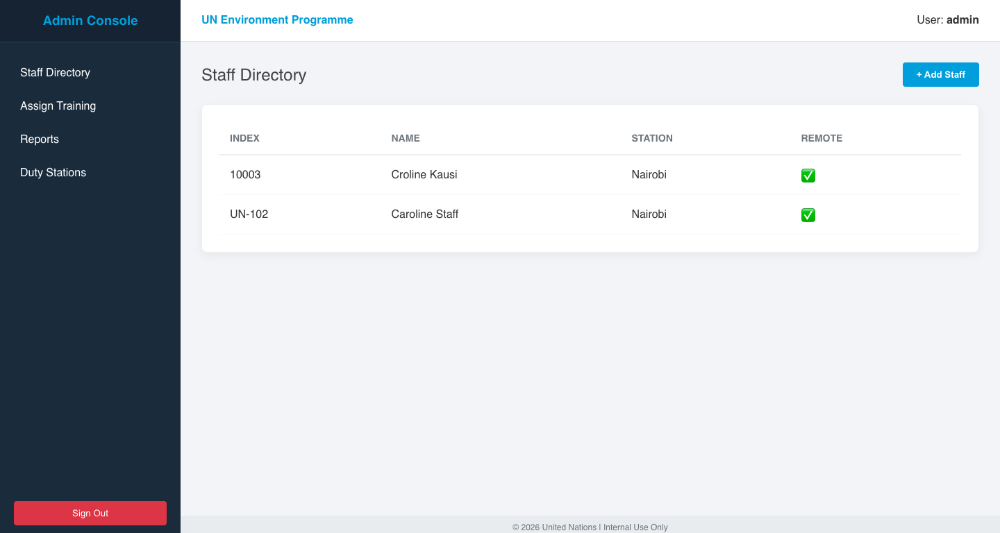
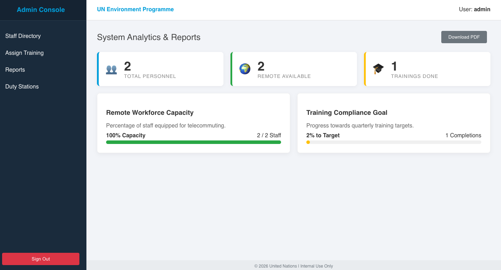
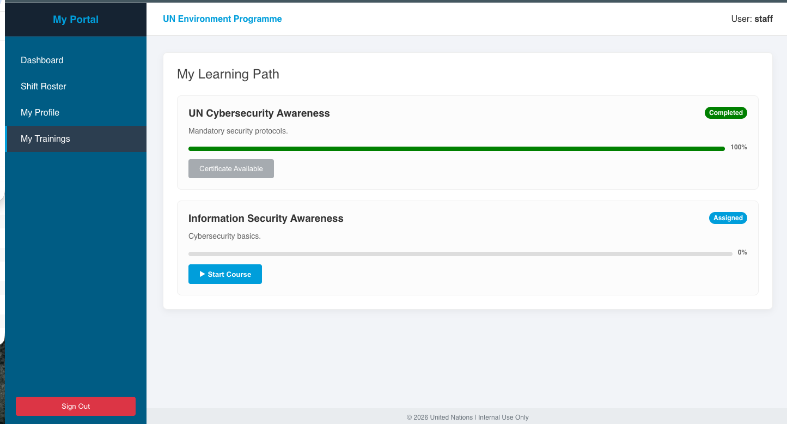
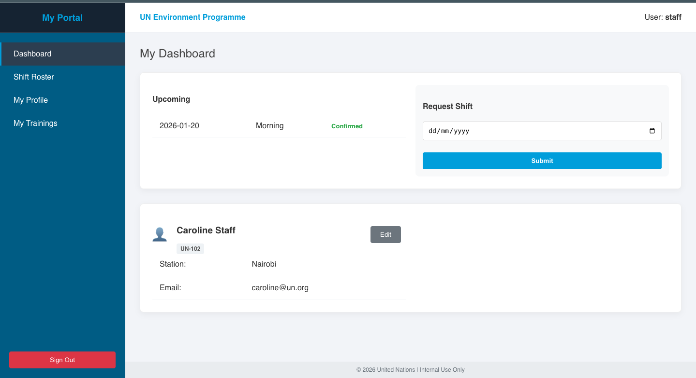
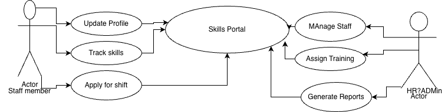

# 🌍 UNEP Skills Portal
### Enterprise Personnel & Training Management System


## 📖 Overview

The **UNEP Skills Portal** is a full-stack web application designed to simulate a UN-standard personnel management system. It facilitates the management of staff across global duty stations, tracks mandatory training compliance, manages shift rosters, and provides visual analytics for HR administrators.

The system features a **Dual-Role Architecture** (Admin vs. Staff) with a clean, professional "UN Blue" user interface.

---

## 🚀 Key Features

### 🛡️ Admin Portal
* **Staff Directory:** CRUD operations for global personnel with search functionality.
* **Duty Station Management:** Manage global locations with active status tracking.
* **Training Management:** Create courses, assign them to staff, and view assignment history.
* **Analytics Dashboard:** Visual metric cards and progress bars tracking remote capacity and training compliance.
* **Auto-Seeding:** The system automatically populates the database with UN-standard courses and settings on startup.

### 👤 Staff Portal
* **Personal Dashboard:** At-a-glance view of shift rosters and profile status.
* **My Trainings:** Track course progress (Assigned → In Progress → Completed) with visual progress bars.
* **Shift Roster:** View upcoming shifts and request schedule changes.
* **Profile Management:** Update contact details and current location.

---

## 🛠️ Tech Stack

* **Frontend:** React.js, CSS3 (Custom Enterprise Theme)
* **Backend:** Node.js, Express.js
* **Database:** MySQL (Relational Data Management)
* **Connectivity:** REST API, CORS enabled
* **Environment:** Configured for Port 5003 (Backend) to avoid macOS AirPlay conflicts.

---

## ⚙️ Installation & Setup

Follow these steps to get the project running locally.

### 1. Database Setup
Ensure you have **MySQL** installed and running.
1.  Open your MySQL Workbench or Terminal.
2.  Create a new database:
    ```sql
    CREATE DATABASE unep_portal_v2;
    ```
3.  *Note: You do NOT need to create tables. The application will auto-generate them.*

### 2. Backend Configuration
1.  Navigate to the backend folder:
    ```bash
    cd backend
    ```
2.  Install dependencies:
    ```bash
    npm install
    ```
3.  **Important:** Open `server.js` and update your MySQL password:
    ```javascript
    const db = mysql.createConnection({
        host: '127.0.0.1',
        user: 'root',
        password: 'YOUR_MYSQL_PASSWORD', // <--- Update this
        database: 'unep_portal_v2',
        multipleStatements: true
    });
    ```
4.  Start the server:
    ```bash
    node server.js
    ```
    *Output should confirm: `Connected to UN Enterprise Database on Port 5003`*

### 3. Frontend Configuration
1.  Open a new terminal and navigate to the frontend folder:
    ```bash
    cd frontend
    ```
2.  Install dependencies:
    ```bash
    npm install
    ```
3.  Start the React application:
    ```bash
    npm start
    ```
    *The app will launch at `http://localhost:3000`*

---

## 🔐 Login Credentials

The system comes pre-seeded with an Administrator account.

| Role | Username | Password | Access Level |
| :--- | :--- | :--- | :--- |
| **Admin** | `admin` | `admin123` | Full System Access |
| **Staff** | *(Create via Admin)* | *(Create via Admin)* | Limited Personal View |
### Sample Staff credentials
| **Staff** | staff| staff123 | Limited Personal View |

**To test the Staff Portal:**
1. Log in as **Admin**.
2. Go to **Staff Directory** -> **+ Add Staff**.
3. Create a new user (remember the Index Number).
4. *Note: For this demo version, you may need to manually add a login entry in the `users` table for the new staff member using SQL, or simply use the Admin view to demonstrate functionality.*

---

## 📸 Screenshots

### 1. Login Page

### 1. Admin Dashboard & Analytics

#### Staff management

#### Reports

#### Duty Stations

### 2. Training Management



### 3. Staff Portal & Learning Path


---

## 📂 Project Structure
### Functional Diagram

### UseCase


## License 
This project is an assignment and it can be used for educational purppose


----
*Developed by Caroline Kausi